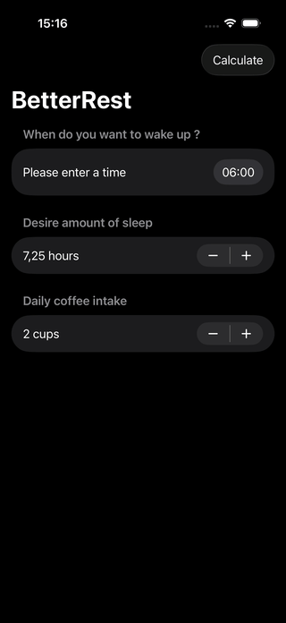

# ☕💤 BetterRest

Une application SwiftUI utilisant le Machine Learning (Core ML) pour calculer l'heure idéale de coucher en fonction de votre heure de réveil, de la durée de sommeil souhaitée et de votre consommation de café.


## 📱 Aperçu

<div align="center">
  
</div>

### Fonctionnalités

BetterRest permet de :
- ⏰ Choisir votre heure de réveil souhaitée
- 😴 Définir la durée de sommeil désirée (4-12 heures, par paliers de 15min)
- ☕ Indiquer votre consommation quotidienne de café (1-20 tasses)
- 🤖 Calculer automatiquement l'heure de coucher idéale via Machine Learning
- 📊 Recevoir une prédiction basée sur 10,000 exemples d'analyse du sommeil

## 🛠️ Technologies utilisées

### Langage & Frameworks
- **Swift** - Langage de programmation moderne d'Apple
- **SwiftUI** - Framework UI déclaratif
- **Core ML** - Framework de Machine Learning d'Apple

### Concepts SwiftUI implémentés

#### State Management
- `@State` - Gestion des états (heure réveil, sommeil, café, alertes)
- **Date handling** - Manipulation de dates avec `Date.now`
- **Binding** - Liaison bidirectionnelle avec `$` pour les inputs

#### Composants UI
- `NavigationStack` - Navigation moderne
- `VStack` - Organisation verticale
- `DatePicker` - Sélecteur de date/heure
  - `displayedComponents: .hourAndMinute` - Affichage uniquement heures/minutes
  - `.labelsHidden()` - Cache les labels visuels (garde pour VoiceOver)
- `Stepper` - Incrémentation/décrémentation de valeurs
  - `in: range` - Limitation des valeurs min/max
  - `step:` - Palier d'incrémentation
- `Button` - Bouton d'action
- `Alert` - Dialogue modal avec message
- `Toolbar` - Barre d'outils en haut

#### Machine Learning (Core ML)
- **MLModelConfiguration** - Configuration du modèle ML
- **Model loading** - Chargement du modèle entraîné (`SleepCalculator.mlmodel`)
- **Prediction** - Inférence avec `model.prediction()`
- **Error handling** - Gestion des erreurs ML avec `do-catch`
- **Dataset** - Modèle entraîné sur 10,000 exemples réels

#### Date & Calendar
- `Calendar.current` - Calendrier système
- `dateComponents()` - Extraction des composants (heures, minutes)
- **Time conversion** - Conversion heures/minutes → secondes
- **Date arithmetic** - Soustraction de dates pour calculer heure de coucher
- `.formatted()` - Formatage moderne des dates
  - `date: .omitted` - N'affiche pas la date
  - `time: .shortened` - Format court (12:00 AM)

#### Patterns Swift/SwiftUI
- **Optional handling** - Nil-coalescing avec `??`
- **Do-catch** - Gestion d'erreurs avec `try`
- **Type conversion** - `Double()` pour convertir Int en Double
- **String interpolation** - `"\(value)"` dans les strings
- **Computed formatting** - `.formatted()` pour les nombres

## 🧠 Comment fonctionne le Machine Learning

### Entraînement du modèle (fait une fois)

Le modèle `SleepCalculator` a été entraîné avec **Create ML** sur un dataset de **10,000 exemples** contenant :
```
wake (secondes) | estimatedSleep (heures) | coffee (tasses) | actualSleep (secondes)
38329           | 6.0                      | 2               | 34803
37600           | 10.0                     | 3               | 41316
28800           | 8.0                      | 10              | 36870
...
```

**Le modèle apprend les patterns :**
- Plus de café → Plus de sommeil nécessaire (qualité réduite)
- Réveil tôt → Besoin de sommeil légèrement accru
- Relations complexes et non-linéaires entre les variables

### Prédiction dans l'app
```swift
// 1. Convertit l'heure de réveil en secondes depuis minuit
hour = 7h × 3600 = 25200 secondes
minute = 30min × 60 = 1800 secondes
wake = 25200 + 1800 = 27000 secondes

// 2. Le modèle ML prédit le sommeil réel nécessaire
prediction = model.prediction(
    wake: 27000.0,
    estimatedSleep: 8.0,
    coffee: 2.0
)
// → actualSleep ≈ 30600 secondes (8.5h)

// 3. Calcule l'heure de coucher
sleepTime = wakeUp - actualSleep
// 7:30 AM - 8.5h = 11:00 PM
```

### Pourquoi plus de café = se coucher plus tôt ?

La caféine réduit la **qualité du sommeil** (moins de sommeil profond, réveils fréquents). Pour obtenir la même récupération, il faut **plus d'heures** de sommeil. Le modèle a appris cette relation à partir des données réelles.

## 🎮 Utilisation

1. **Choisir l'heure de réveil** avec le DatePicker
2. **Définir la durée de sommeil** souhaitée (Stepper 4-12h)
3. **Indiquer le nombre de cafés** bus dans la journée (Stepper 1-20)
4. **Appuyer sur "Calculate"** dans la toolbar
5. **Voir le résultat** : "Your ideal bedtime is... 11:00 PM"

## 📖 Concepts appris

### Swift
- Manipulation de dates et calendriers
- Conversion de temps (heures → secondes)
- Gestion d'erreurs avec do-catch-try
- Optionnels et nil-coalescing (`??`)
- Type casting (Int → Double)

### SwiftUI
- DatePicker pour saisie de dates/heures
- Stepper pour valeurs numériques incrémentables
- Toolbar avec boutons d'action
- Alertes modales avec titres et messages
- Labels cachés pour accessibilité (VoiceOver)
- Formatage moderne avec `.formatted()`

### Core ML
- Chargement d'un modèle ML pré-entraîné
- Configuration du modèle (`MLModelConfiguration`)
- Inférence (prédiction) avec inputs multiples
- Gestion des erreurs ML
- Comprendre l'entraînement vs la prédiction

### Machine Learning (concepts)
- **Training** : Le modèle apprend de 10,000 exemples
- **Inference** : Le modèle prédit sur de nouvelles données
- **Généralisation** : Prédire pour des combinaisons jamais vues
- **Patterns** : Découverte de relations complexes
- **Quality vs Quantity** : Impact du café sur la qualité du sommeil

### Science du sommeil
- Impact de la caféine sur la qualité du sommeil
- Besoin de compensation (plus d'heures si mauvaise qualité)
- Relation entre heure de réveil et besoin de sommeil

## 🚀 Installation
```bash
# Cloner le repository
git clone https://github.com/ton-username/BetterRest.git

# Ouvrir le projet dans Xcode
cd BetterRest
open BetterRest.xcodeproj
```

**Prérequis :**
- Xcode 15+
- iOS 16.0+
- macOS 13+ (pour développement)

**Fichiers nécessaires :**
- `SleepCalculator.mlmodel` - Modèle ML entraîné (inclus dans le projet)
- `BetterRest.csv` - Dataset d'entraînement (optionnel, pour référence)

## 💡 Améliorations possibles

- [ ] Interface plus visuelle avec gradients (café/nuit)
- [ ] Graphique montrant l'impact du café sur le sommeil
- [ ] Historique des prédictions avec SwiftData
- [ ] Widget iOS pour voir l'heure de coucher rapidement
- [ ] Notifications pour rappeler d'aller se coucher
- [ ] Mode sombre optimisé
- [ ] Support Apple Watch
- [ ] Intégration avec Health app (données de sommeil réelles)
- [ ] Entraîner un modèle personnalisé avec les données de l'utilisateur
- [ ] Conseils personnalisés basés sur les patterns de l'utilisateur
- [ ] Support de la sieste (impact sur le sommeil nocturne)

## 🎨 Design

- **Navigation moderne** avec NavigationStack
- **Toolbar** avec bouton Calculate
- **Steppers** pour saisie intuitive des valeurs
- **DatePicker** pour heure de réveil
- **Alertes** pour affichage du résultat
- **Accessibilité** : Labels cachés mais présents pour VoiceOver

## 📊 Dataset

Le modèle a été entraîné sur **10,000 exemples** avec :
- **wake** : Heure de réveil (6h-11h principalement)
- **estimatedSleep** : Sommeil désiré (4-12h)
- **coffee** : Nombre de cafés (0-10+ tasses)
- **actualSleep** : Sommeil réel nécessaire (données observées/simulées)

### Statistiques du dataset :
- Plage de réveil : ~6:00 AM - 11:00 AM
- Sommeil moyen désiré : ~8h
- Café moyen : ~3 tasses
- Impact moyen du café : +0.5 à +2h de sommeil nécessaire

## 👨‍💻 Auteur

**Guillaume Richard**  
🚀 Apprenant développement Swift & SwiftUI | En formation full-stack MERN  
🥽 Exploration du développement spatial avec visionOS  
🤖 Découverte du Machine Learning avec Core ML

## 📝 Licence

Ce projet est un projet d'apprentissage personnel.

---

*Projet réalisé dans le cadre de l'apprentissage de SwiftUI et Core ML - Janvier 2026*
